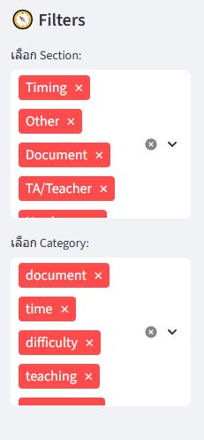
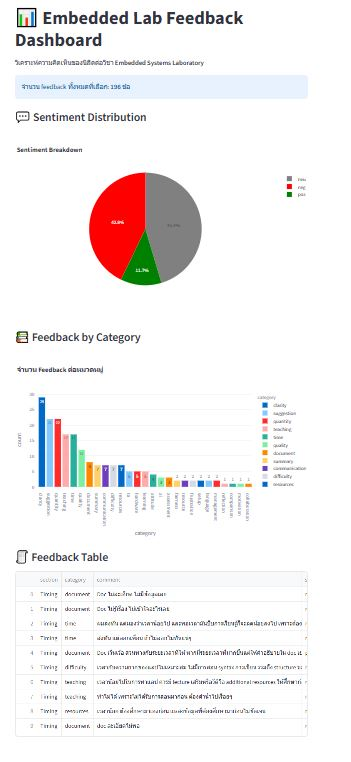

# 🧩 Embedded Lab Feedback Analytics

A mini data project analyzing student feedback from the **Embedded Systems Laboratory** course at Chulalongkorn University.  
This project demonstrates a complete workflow from **data extraction, anonymization, and ETL**, through **analysis** and **visualization**,  
covering **Data Engineering** and **Data Analytics** components.

---

## 📂 Project Structure

```

assets/                  # picture assets
├── dashboard.JPG                 
├── sentiment_bar.JPG           
└── wordcloud.png        

data/
├── raw/                # original survey or feedback files
├── interim/             # cleaned but not yet finalized
└── processed/           # ready-to-analyze datasets

db/
├── schema.sql           # table schema
└── sample_queries.sql   # example SQL queries

notebooks/
├── 01_extract_clean.ipynb         # cleaning and transformation
├── 02_eda.ipynb                   # exploration and visualization
└── 03_advanced_analytics.ipynb    # sentiment + word cloud + insights

src/
├── anonymize.py          # anonymization logic for names and TA references
├── etl_load.py           # ETL pipeline to load data into PostgreSQL
└── sentiment_analysis.py # keyword or model-based sentiment module

dashboard/
└── app.py                # Streamlit / Plotly dashboard

docs/
├── data_dictionary.md
└── ethics_disclaimer.md
```

---

## 🎯 Project Objectives
- Build a reproducible **ETL pipeline** to clean and load feedback data into PostgreSQL  
- Perform **exploratory data analysis (EDA)** to uncover trends and feedback patterns  
- Conduct **rule-based sentiment analysis** on Thai comments  
- Visualize findings interactively through a **Streamlit dashboard**  
- Apply **data ethics and anonymization** best practices  

---

## 🧰 Tech Stack
| Category | Tools / Libraries |
|-----------|------------------|
| **Language** | Python 3.13, SQL |
| **Data Handling** | pandas, numpy, re |
| **Visualization** | matplotlib, seaborn, wordcloud |
| **Database** | PostgreSQL + SQLAlchemy |
| **Text Analysis** | PyThaiNLP *(rule-based sentiment)* |
| **App / Dashboard** | Streamlit, Plotly Dash |
| **Env Management** | python-dotenv (.env) |
| **Version Control** | Git + GitHub |

---

## 🗓️ Timeline (MVP)
| Day | Phase | เป้าหมายหลัก | ผลลัพธ์ที่ได้ |
|:--:|:--|:--|:--|
| **Day 0** | 🔧 Setup & Planning | สร้าง repo, README, ethics disclaimer, โครงสร้าง project | โครงสร้าง repo พร้อมใช้งาน |
| **Day 1** | 🧹 Data Extraction & Cleaning | แปลง feedback PDF → CSV และ clean ข้อความ | `feedback_raw.csv` |
| **Day 2** | 🛡️ Anonymization & ETL | ลบชื่อ อาจารย์ / TA ด้วย `anonymize.py` และ โหลดเข้า DB | `feedback_clean.csv` + ตาราง `feedback` ใน PostgreSQL |
| **Day 3** | 📊 Database Validation & EDA | ตรวจสอบ schema, query, และ ทำ EDA ด้วย SQL + Python | กราฟ และ สรุป ข้อมูล เบื้องต้น |
| **Day 4** | 🧠 Sentiment & Advanced Analytics | วิเคราะห์ อารมณ์ (pos / neu / neg) + Word Cloud และ Top Keywords | `feedback_sentiment.csv` + กราฟ เชิงลึก |
| **Day 5** | 📈 Dashboard Development | สร้าง Streamlit dashboard พร้อม filter และ กราฟ interactive | `dashboard/app.py` |
| **Day 6** | 🎨 Storytelling & Insight Design | ปรับ layout, สรุป key insights, เตรียม presentation | Final graphs + storyboard |
| **Day 7** | 🚀 Final Report & Portfolio Prep | เขียน README สรุปผล และ เตรียม portfolio | Repo พร้อม showcase ใน GitHub / Resume |

---

## 📸 Example Visuals

| Visualization | Preview |
|----------------|----------|
| **📈 Sentiment Distribution by Section** |  |
| **☁️ Word Cloud (Thai Feedback)** |  |
| **📊 Dashboard Snapshot (Streamlit)** |  |

---

## 📊 Day 6 Summary — Advanced Analytics & Insights

### 🧠 Sentiment Analysis (Rule-Based)
ใช้ชุดคำเชิงบวกและลบในการจำแนกอารมณ์ของ feedback  
- บวก → “เข้าใจ”, “ชอบ”, “ขอบคุณ”, “เยี่ยม”  
- ลบ → “ไม่เข้าใจ”, “ยาก”, “เสียเวลา”, “งง”  

📈 **ผลลัพธ์รวม:**  
- 39% Neutral  
- 35% Negative  
- 26% Positive  

→ Feedback ส่วนใหญ่ค่อนข้าง “กลางถึงลบ” โดยเฉพาะหัวข้อ **Timing** และ **Document**

---

### 🌤️ Average Sentiment Score by Section
| Section | Avg Sentiment | ความเห็นสรุป |
|:--|:--:|:--|
| **TA / Teacher** | ~0.0 | มีคำชมว่า “ช่วยดี / อธิบายเข้าใจ” |
| **Hardware** | ~-0.15 | มีทั้งบวกและลบ เช่น “อุปกรณ์ไม่พอ” |
| **Document** | ~-0.20 | “เอกสารไม่ละเอียด เข้าใจยาก” |
| **Timing** | ~-0.4 | “เวลาไม่พอ / ทันน้อย” |
| **Other** | ~-0.45 | รวม feedback ทั่วไป เช่น lab หนัก / ยาก |

---

### ☁️ Word Cloud Highlights
คำหลักที่พบมากสุด:
> “ไม่”, “ยาก”, “TA”, “ทำให้”, “เวลา”, “เข้าใจ”, “ดี”, “ขอบคุณ”

💬 Keyword หลักสะท้อน 3 theme สำคัญ:
- **เวลา** → คำบ่นหลัก เช่น “ไม่ทัน”, “เวลาน้อย”  
- **เอกสาร / Doc** → เรื่องความชัดเจน  
- **TA / ผู้ช่วยสอน** → ได้รับคำชมเชิงบวก

---

### 🔤 Top 15 Frequent Words

คำที่เจอบ่อยสุดในทุก feedback:
| Rank | Word | หมายเหตุ |
|:--:|:--|:--|
| 1 | ไม่ | พบมากใน “ไม่เข้าใจ”, “ไม่ทัน”, “ไม่มี” |
| 2 | ดี | คำชมทั่วไป |
| 3 | เข้าใจ | Positive keyword |
| 4 | TA | ตัวแทน feedback ส่วน “ผู้ช่วยสอน” |
| 5–10 | ยาก, ทำให้, เวลา, แต่, ห้อง, แรง | สะท้อนเรื่องการเรียนรู้และการทดลองจริง |

---

### 🧩 Key Insights
- ⏱️ **Timing** → พูดถึงมากสุด และมักเป็น feedback เชิงลบ (“เวลาไม่พอ”)  
- 📄 **Document** → คะแนนต่ำสุด ต้องปรับปรุงความละเอียด  
- 🙋‍♂️ **TA** → ได้รับ feedback เชิงบวกต่อความช่วยเหลือและคำอธิบาย  
- 🔌 **Hardware** → กลางถึงบวก แต่มีข้อจำกัดเรื่องจำนวนอุปกรณ์  
- 💡 **ภาพรวม**: นักศึกษาส่วนใหญ่เข้าใจเนื้อหา แต่ติดปัญหาเวลาและเอกสารประกอบ  

---

## 📈 Overall Findings
- TA / Teacher section มี sentiment สูงสุด (ส่วนใหญ่ชม)  
- Document & Timing มีคะแนนต่ำสุด  
- Word Cloud ยืนยันว่า “เวลา”, “ไม่เข้าใจ”, “ขอบคุณ”, “TA” คือคำหลัก  
- Insight เหมาะต่อการวางแผนปรับปรุง lab เอกสาร และเวลาทดลอง  

---

## 👨‍💻 Author
**Thanayot Chalernpornlert**  
Computer Engineering Student @ Chulalongkorn University  
📧 *thanayot.47@gmail.com* | 🌐 [github.com/besttny](https://github.com/besttny)

---