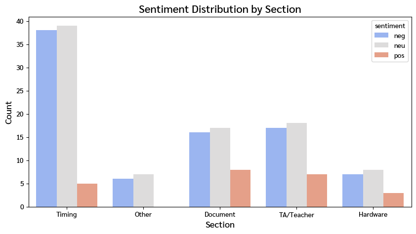
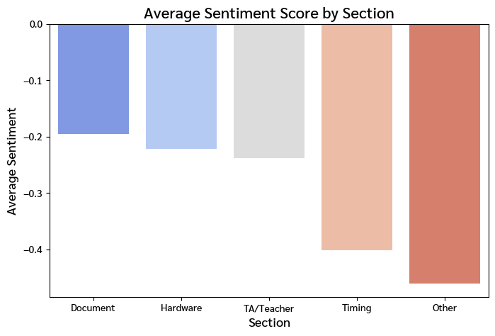
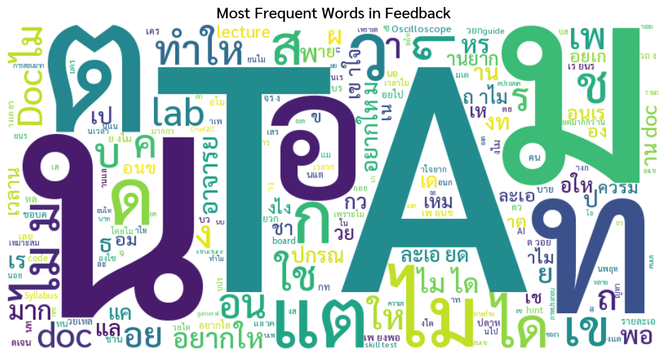
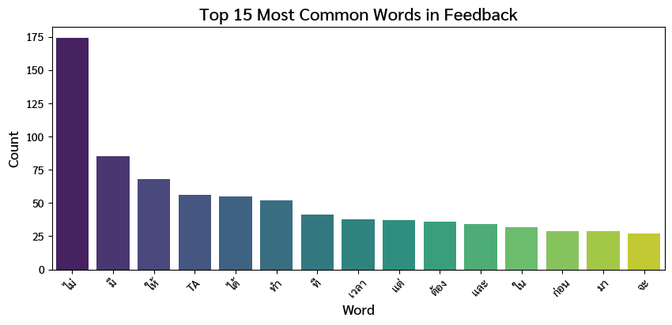
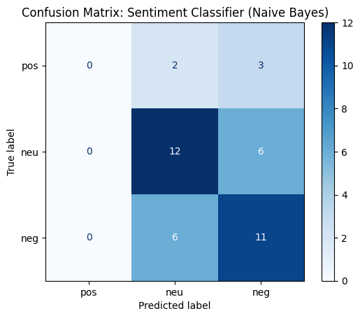

# 🧩 Embedded Lab Feedback Analytics

A mini data project analyzing student feedback from the **Embedded Systems Laboratory** course at Chulalongkorn University.  
This project demonstrates the full data pipeline from **data extraction**, **anonymization**, **ETL**, **analysis**, and **visualization**,  
covering **Data Engineering** and **Data Analysis**, with an **Machine Learning extension**.

---

## 📂 Project Structure

```

assets/ # picture assets
├── dashboard.JPG                 
├── sentiment_bar.JPG   
├── avgsentimentscorebysection.png 
├── bayes.png 
├── mostfreqword.png  
├── sentimentdistribution.png 
├── top15word.png         
└── wordcloud.png        

data/
├── raw/ # original survey or feedback files
├── interim/ # cleaned but not yet finalized
└── processed/ # ready-to-analyze datasets

db/
├── schema.sql # table schema
└── sample_queries.sql # example SQL queries

notebooks/
├── 01_extract_clean.ipynb # cleaning and transformation
├── 02_eda.ipynb # exploration and visualization
├── 03_advanced_analytics.ipynb # sentiment + word cloud + insights
└── 04_ml_sentiment.ipynb # Naive Bayes sentiment model

src/
├── anonymize.py # anonymization logic
├── etl_load.py # ETL pipeline to PostgreSQL
└── sentiment_analysis.py # keyword / model-based sentiment module

dashboard/
└── app.py # Streamlit / Plotly dashboard

docs/
├── data_dictionary.md
└── ethics_disclaimer.md
```

---

## 🎯 Project Objectives
- Build a reproducible **ETL pipeline** to clean & load feedback into PostgreSQL  
- Perform **EDA** to discover trends and patterns  
- Conduct **sentiment analysis** (rule-based and ML-based)  
- Visualize insights through an **interactive dashboard**  
- Apply **data ethics & anonymization** best practices  

---

## 🧰 Tech Stack
| Category | Tools / Libraries |
|-----------|------------------|
| **Language** | Python 3.13, SQL |
| **Data Handling** | pandas, numpy, re |
| **Visualization** | matplotlib, seaborn, wordcloud |
| **Database** | PostgreSQL + SQLAlchemy |
| **Text Analysis** | PyThaiNLP / Naive Bayes ML |
| **App / Dashboard** | Streamlit / Plotly |
| **Env Mgmt** | dotenv (.env) |
| **Version Control** | Git + GitHub |

---

## 🗓️ Timeline (MVP)
| Day | Phase | เป้าหมายหลัก | ผลลัพธ์ที่ได้ |
|:--:|:--|:--|:--|
| 0 | 🔧 Setup & Planning | สร้าง repo & โครงสร้าง project | repo พร้อมใช้งาน |
| 1 | 🧹 Data Cleaning | แปลง feedback PDF → CSV | `feedback_raw.csv` |
| 2 | 🛡️ Anonymization & ETL | ลบชื่อ TA / อาจารย์ | `feedback_clean.csv` + PostgreSQL |
| 3 | 📊 Database & EDA | query + วิเคราะห์ เบื้องต้น | EDA graphs |
| 4 | 🧠 Sentiment Analysis | rule-based sentiment + word cloud | `feedback_sentiment.csv` |
| 5 | 📈 Dashboard | Streamlit interactive UI + filters | `dashboard/app.py` |
| 6 | 🎨 Storytelling | สรุป key insights + presentation | final graphs |
| 7 | 🚀 Report & Portfolio | README + portfolio summary | GitHub showcase |
| 8 | 🤖 Machine Learning Extension | train Naive Bayes model | `sentiment_nb.pkl` |

---

## 🛡️ Data Ethics
This dataset has been **fully anonymized** and is used **solely for educational and portfolio purposes**.  

📄 [`docs/ethics_disclaimer.md`](docs/ethics_disclaimer.md)

---

## 📊 Day 6 Summary — Advanced Analytics & Insights

### 🧠 Sentiment Analysis (Rule-Based)  
- 39% Neutral  
- 35% Negative  
- 26% Positive  
- Keywords บวก: “เข้าใจ”, “ชอบ”, “ขอบคุณ”, “เยี่ยม” 
- Keywords ลบ: “ไม่เข้าใจ”, “ยาก”, “เสียเวลา”, “งง”  

📈 **Sentiment Distribution by Section**


---

### 🌤️ Average Sentiment Score by Section
| Section | Avg Sentiment | ความเห็นสรุป |
|:--|:--:|:--|
| **Document** | ~-0.20 | เอกสารไม่ละเอียด เข้าใจยาก มีปัญหาเรื่องภาษา |
| **Hardware** | ~-0.20 | มีทั้งบวกและลบ เช่น อุปกรณ์ไม่พอ |
| **TA / Teacher** | ~-0.20 | มีคำติเยอะเช่น ไม่ช่วยเหลือ แต่ก็มีคำชมบ้าง เช่น ช่วยดี / อธิบายเข้าใจ |
| **Timing** | ~-0.4 | เวลาไม่พอ / คนทำทันน้อย |
| **Other** | ~-0.45 | รวม feedback ทั่วไป เช่น lab หนัก / ยาก |

📊 **Average Sentiment Score by Section**


---

### ☁️ Word Cloud & Top Words
**คำยอดนิยม:** “ไม่”, “แต่”, “TA”, “อยากให้”, “เวลา”, “ไม่ละเอียด”

🌥️ **Word Cloud**


📈 **Top 15 Most Common Words**


---

### 🧩 Key Insights
- ⏱️ **Timing** → พูดถึงมากสุด และมักเป็น feedback เชิงลบ (“เวลาไม่พอ”)  
- 📄 **Document** → คะแนนลบต่ำสุด แต่ต้องปรับปรุงความละเอียด  
- 🙋‍♂️ **TA** → ได้รับ feedback ทั้งเชิงบวกและลบ
- 🔌 **Hardware** → กลางถึงบวก แต่มีข้อจำกัดเรื่องจำนวนอุปกรณ์  
- 💡 **ภาพรวม**: นักศึกษาส่วนใหญ่เข้าใจเนื้อหา แต่ติดปัญหาเวลาและเอกสารประกอบ  

---

## 🤖 Day 8 — Machine Learning Extension (Naive Bayes Model)

### ⚙️ Model Details
- Algorithm: **Multinomial Naive Bayes**  
- Feature Extraction: TF-IDF (1–2 gram)  
- Tokenizer: PyThaiNLP word_tokenize  
- Data: Feedback จาก Lab ทุก section  

---

### 📈 Model Performance
| Metric | Result |
|:--|:--|
| Accuracy | ≈ 0.70 |
| Precision | ต่ำใน class `pos` (ข้อมูล ไม่ balance) |
| Recall (neu/neg) | ค่อนข้างดี |
| Confusion Matrix | ดูภาพด้านล่าง |

🧾 **สรุป:** โมเดล แยก “neutral” กับ “negative” ได้ดี แต่ จับ “positive” ได้น้อย  
เนื่องจาก feedback บวก มีจำนวนน้อย  

📊 **Confusion Matrix: Sentiment Classifier (Naive Bayes)**


---

### 💡 Insights จาก Model
- คำลบ (“ไม่เข้าใจ”, “เสียเวลา”) ถูกจำแนกแม่นมาก  
- คำชม (“ดี”, “ขอบคุณ”) ยังมีน้อย → โมเดลเรียนรู้ไม่ครบ  
- เหมาะสำหรับ baseline classifier สำหรับ Thai feedback  

---

## 👨‍💻 Author
**Thanayot Chalernpornlert**  
Computer Engineering Student @ Chulalongkorn University  
📧 *thanayot.47@gmail.com*  |  🌐 [github.com/besttny](https://github.com/besttny)

---